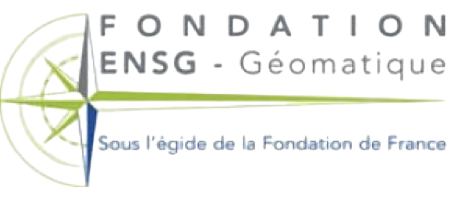

# Massive data contributions from the National Land Survey of Finland to the OpenStreetMap Database :earth_africa:
Hello and welcome :blush:! Here you will find the relevant code and visualizations I created during my internship, as well as the corresponding report that gives more insight into the work I did during my 3-month stay in Espoo (Finland). Due to its large size, all data used and created has been hosted on an external cloud service, which can be accessed via the link below.

## Raw data & created data downloading

## Abstract
The Finnish Geospatial Research Institute (FGI) is located in the city of Espoo, west of the capital city of Helsinki. It conducts innovative research and expert work in the field of spatial data, and more specifically, deals with — interoperable web services, technical standards and harmonization of spatial data — which are the core areas of the Geoinformatics and Cartography department in which I train.
Following on from the harmonization of spatial data, which aims to standardize geographic information across the European Union, the goal of my work is to identify the massive contributions from the NLS (higher body under which the FGI is submitted) to the OpenStreetMap database to get a situation picture of the NLS data on the Internet, as well as part of a preliminary risk assessment, this in the hope of contributing to future studies on the potential of imported features that have undergone geometric modifications to improve the NLS topographic database.
Our study begins by obtaining the data of interest from well-known data providers such as Geofabrik.de and Planet OSM, before presenting some OSM data manipulation techniques using — Osmium Tool, GDAL OSM Driver, Python and SQL (PostgreSQL) — in preparation for the data analysis phase.
First results help to assume the location of NLS-related buildings with massive contributions in the Finnish Uusimaa region, as well as the location of those that have undergone geometric modifications.

## Internship report
[Quick access](final_report/REN-Alexys_Pluri-2023.pdf) :green_book:

## Educational institution & Host organisation
&nbsp;

## Funding bodies
&nbsp;&nbsp;

## License
This repository is licensed under the MIT License — For more information, see [LICENSE](LICENSE).